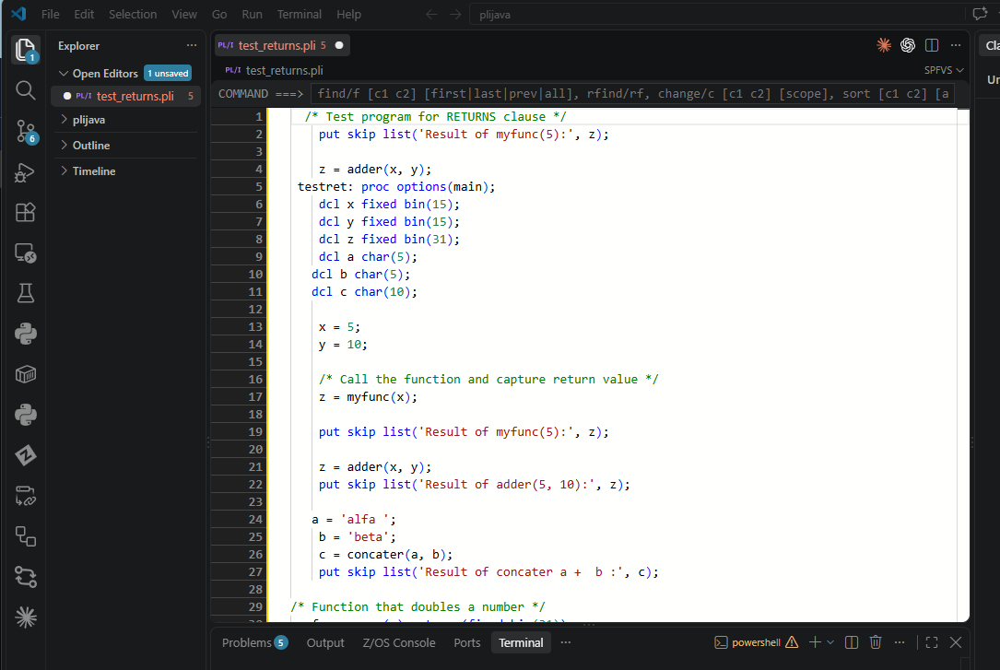

# SPFVS

A VS Code custom editor that recreates the ISPF full-screen editing
experience: a Monaco-based editor with a real, editable prefix-command
gutter to its left (`cc`...`cc`, `mm`...`aa`, `dd`...`dd`, `d5`, etc.),
instead of VS Code's plain line-number column.

Opens on demand for any file via **Reopen With -> SPFVS** — it does
not replace VS Code's default editor.



## Project layout

- `extension/` — the VS Code extension (TypeScript). Owns the custom
  editor registration, the Monaco integration, and the viewport-synced
  gutter overlay (`extension/media/gutter.ts` — see the comment at the
  top of that file for why it's a plain DOM overlay rather than a Monaco
  widget).
- `backend/` — a Python package (`ispf_backend`) implementing ISPF
  line-prefix-command semantics (delete/repeat/insert/copy/move/exclude,
  single and block forms, plus LABEL, UC/LC case conversion, and a
  shared CUT/PASTE clipboard). Unit-tested; talks to the extension over
  newline-delimited JSON on stdin/stdout. See the module docstring in
  `backend/ispf_backend/prefix_commands.py` for the full supported
  command set and validation rules.

## Running it

**Backend tests** (the correctness gate for prefix-command semantics):

```
cd backend
pip install -e .
pip install pytest
pytest
```

**Extension, in the VS Code Extension Development Host:**

```
cd extension
npm install
npm run compile
```

Then open the `extension/` folder in VS Code and press F5 (or use
**Run SPFVS Extension** from the Run panel) to launch a dev host window.
In that window, open any file and use **Reopen With -> SPFVS**.

The extension spawns `python -m ispf_backend` from PATH by default;
set `spfvs.pythonPath` in settings if your Python isn't on PATH.

## Installing on another machine

There's no Marketplace listing, so getting this onto a second machine
means cloning the (private) source repo:

```
git clone https://github.com/markons/spfvs.git
```

Two independent things are then required to actually run it — independent
because **the packaged `.vsix` does not contain the Python backend at
all**: `extension/.vscodeignore` strips everything down to the compiled
`dist/`, the icon, and `package.json`, and `backend/` isn't even inside
`extension/` to begin with, so `vsce package` never sees it.

Prerequisites on the target machine:

- VS Code 1.90 or newer.
- Python 3.9+ with `pip`, reachable as `python` on PATH (or note its
  full path — you'll need it for the `spfvs.pythonPath` setting
  below if it isn't).
- Node.js + npm — only needed if you're building the `.vsix` **on** this
  machine; skip it entirely if you're just copying in an already-built
  `.vsix` from wherever it was built.

**1. Install the Python backend.** This is what actually gets spawned as
`python -m ispf_backend` at runtime — do this on the target machine,
from the `backend/` folder:

```
cd backend
pip install .
```

Use `pip install .` (not the `-e .` from "Running it" above) for a
machine that's going to run this, not develop it: a regular install
copies the package into `site-packages`, so the `backend/` source folder
doesn't need to stick around afterward. `-e .` is only worth it if
you're actively editing backend code on that same machine and want
changes picked up without reinstalling.

**2. Build and install the extension.** Either build fresh, on the
target machine:

```
cd extension
npm install
npx vsce package
code --install-extension spfvs-<version>.vsix
```

...or build the `.vsix` once anywhere with Node/npm installed, then copy
just that one `.vsix` file to the target machine and run the
`code --install-extension` line there — Node/npm aren't needed on a
machine that's only installing an already-built `.vsix`, not building one.

**3. Point at Python, if needed.** If `python` isn't on PATH on the
target machine, or resolves to a different Python than the one step 1
installed the backend into, set `spfvs.pythonPath` (VS Code
settings) to that Python's full path *before* opening a file in SPFVS —
otherwise the extension shows an error trying to launch the backend, per
file, until this is set.

**4. Use it.** Open any file, **Reopen With -> SPFVS**.

**Updating an existing install** (a newer `.vsix` after a code change):
bump the `version` field in `extension/package.json` before repackaging
— VS Code's webview asset caching plus its install-folder-per-version
behavior make it genuinely ambiguous whether a same-version reinstall
actually took effect. After `code --install-extension --force` with the
bumped version, **Developer: Reload Window** has been sufficient in
practice to pick it up; a full quit-and-relaunch of VS Code is the
guaranteed fallback if Reload Window ever doesn't seem to take. If the
**backend** changed too, re-run `pip install .` in `backend/` as well —
the extension restarts its backend process automatically the next time
it's needed, but only picks up new backend code if the installed Python
package itself was actually updated first.

## Supported prefix commands (MVP)

Each prefix cell is a real, independent text input, but it also
supports two ISPF-style navigation shortcuts so it doesn't feel like a
plain isolated text box: **Up/Down arrow** moves focus to the cell for
the line above/below (preserving the caret's column position), the
classic ISPF convention of walking the prefix area with the cursor keys
instead of the mouse or Tab; **Home** jumps to the `COMMAND ===>` bar
(see below). Typing is still per-cell and uncommitted until `Enter`.

| Code | Meaning |
|---|---|
| `d[n]` | delete n lines starting here (default 1) |
| `r[n]` | repeat this line n times |
| `rr`...`rr` | repeat the block between two `rr` markers (a count on either marker, e.g. `rr3`, repeats it that many times) |
| `i[n]` | insert n blank lines after this line |
| `c[n]` | mark n lines starting here as a copy source — pairs with `a`/`b` for an immediate in-file copy, or becomes a **pending mark** for the `CUT` primary command if left unpaired |
| `m[n]` | mark n lines starting here as a move source — same as `c[n]`, but its pending-mark form is resolved by `CUT` into a clipboard *move* instead of a copy |
| `dd`...`dd` | delete the block between two `dd` markers |
| `cc`...`cc` | mark a block as a copy source — must still be closed by a second `cc` (unmatched is an error); see `c[n]` for the unpaired-mark behavior |
| `mm`...`mm` | mark a block as a move source (see `m[n]` for the unpaired-mark behavior) |
| `a` | destination marker: after this line — pairs with a pending `c`/`m` source for an in-file copy/move, exactly as always |
| `b` | destination marker: before this line — same as `a` |
| `x[n]` | EXCLUDE: hide n lines starting here from view (default 1) |
| `xx`...`xx` | EXCLUDE the block between two `xx` markers from view |
| `)`, `))`, ... / `>`, `>>`, ... | SHIFT this line's text right by 2 columns per repeated character |
| `)n` / `>n` | SHIFT this line's text right by exactly n columns |
| `(`, `((`, ... / `<`, `<<`, ... | SHIFT this line's text left by 2 columns per repeated character |
| `(n` / `<n` | SHIFT this line's text left by exactly n columns |
| `.name` | LABEL: assign `name` (1-8 chars, must start with a letter) to this line |
| `.` | clear whatever label is on this line |
| `uc` | UPPERCASE this line's text |
| `lc` | lowercase this line's text |
| `uc`...`uc` / `lc`...`lc` | UPPERCASE/lowercase the range between two markers, inclusive |
| `hx[n]` | show n lines' hex representation as two rows underneath each (default 1); typing `hx` again on an already-shown line hides it |
| `cols` | show/hide an ISPF-style column ruler underneath this line (no count form — toggle only) |

**A lone (unpaired) `c[n]`/`cc`...`cc`/`m[n]`/`mm`...`mm` is not an
error** — it becomes a *pending mark*, persistent editor-session state
(like a label) that the `CUT` **primary** command (typed in
`COMMAND ===>`, not the gutter — see below) later resolves: a "copy"
mark is copied into a shared clipboard non-destructively, a "move" mark
is cut (removed and stored). A lone `a`/`b` with no pending source to
pair with is still an ordinary error, same as always — inserting from
the clipboard is the `PASTE` **primary** command's job, and it doesn't
use `a`/`b` at all. Setting a new mark while one is already pending (not
yet resolved by `CUT`) is also an error, so a forgotten mark can't be
silently overwritten. See "Primary commands" below for the full
`CUT`/`PASTE` workflow — the intended shape is: mark lines here in the
gutter, run `CUT`, move to wherever you want them (any open file), run
`PASTE`.

A copy/move source's destination marker can be on a line before **or**
after the source (moving a block up the file works the same as moving it
down). Committing a batch keeps the cursor and scroll position where they
were (Monaco's own `setValue()`, used to apply the backend's resulting
document, would otherwise reset the view to the top of the file on every
commit). A batch of prefix commands is applied all-or-nothing: any error
(unmatched block marker, overlapping ranges, setting a mark while one is
already pending, etc.) rejects the whole batch and leaves the offending
gutter cells in place with a tooltip explaining why, instead of partially
applying it.

`)`/`(` and their `>`/`<` aliases physically edit the line, unlike every
other command on this page below (labels/exclude are view-only, the rest
restructure whole lines): shifting right prepends blank columns, and
shifting left **blindly drops** the leftmost n characters, blank or not —
matching real ISPF, where shifting left too far discards actual text
rather than stopping politely at the first non-blank column. `2 columns
per repeated character` is a documented default this project chose (the
2 isn't independently verified against IBM's own default, which is
profile-configurable); an explicit `)n`/`(n`/`>n`/`<n` count always
overrides it with an exact column number instead of a multiple.

Like a LABEL, `x`/`xx` don't restructure the document — hiding a line is a
view-only effect, persistent editor-session state that follows its line
through later restructuring the same way a label does (dropped if the
line is deleted, follows a moved line, stays put on a copy/repeat/insert's
source line). Unlike a label, there's no prefix command to *un*-hide a
specific line once excluded this way — that's what the `RESET` primary
command is for (see below), matching ISPF. `x`/`xx` also *accumulate*
across separate gutter commits (hide one line, then hide another later —
both stay hidden), unlike the primary `EXCLUDE` command below, which
replaces the whole hidden set on each call.

Unlike the commands above, a LABEL doesn't restructure anything either —
it's persistent, editor-session state (dropped on any external change to
the document, since it's tracked purely by line number) that stays
displayed in its gutter cell instead of being cleared after it's applied.
It moves with its line when that line is moved, stays put on a
copy/repeat/insert's *source* line, and is dropped if its line is
deleted. Names are case-insensitive (folded to uppercase) and names
starting with `Z` are reserved for the system labels
`.ZFIRST`/`.ZLAST`/`.ZCSR` (first line, last line, current cursor line —
always available, never stored), the same reservation ISPF itself makes.
Labels are used as operands for the `LOCATE` primary command and a
two-label `EXCLUDE`/`X` range — see below.

`uc`/`lc` don't need doubling to a block form the way `dd`/`cc`/`mm`/`xx`
do: the code appearing on exactly **one** line converts just that line;
appearing on exactly **two** lines converts the range between them
(matching real ISPF); appearing on more than two in one batch is
rejected as ambiguous rather than guessed at.

`hx`/`hx[n]` is a pure **view** effect, unlike everything else in this
table — it never restructures or even touches the document, and (unlike
LABEL/EXCLUDE) never reaches the Python backend at all: the gutter
intercepts it locally and drives Monaco's own view-zone API directly
(`extension/media/hexView.ts`), the same "space reserved in the render,
not the model" trick EXCLUDE's folding uses. Each row is one hex digit
per character — high nibble on top, low nibble below, both directly
under the source character — rather than two digits squeezed under one
column, which wouldn't fit a monospace cell; a character is masked to
one byte (its low UTF-16 byte), so this isn't a byte-accurate UTF-8
breakdown for anything outside Latin-1, just an ISPF-flavored "peek at
this line's bytes." A bare `hx` **toggles** (type it again to hide); the
counted form `hx3` always **shows** (never hides) each of the 3 lines,
since toggling several at once when some already had hex shown and
others didn't would give a confusing mixed result. Any document edit
hides every currently-shown hex zone rather than trying to keep them
pinned to lines that may have moved.

`cols` is the same category of pure view effect as `hx` — a column
ruler (`----+----1----+----2----+----3...`, ISPF's own pattern: a `-`
per column, `+` every 5th, the tens digit every 10th) shown underneath
the line, driven by `extension/media/colsView.ts` via the exact same
view-zone mechanism as `hx`, intercepted locally the same way before it
would otherwise reach the backend as an unknown command. Unlike `hx`,
`cols` has no counted form — real ISPF's own COLS line command takes no
operand either — so it's toggle-only. The ruler spans the longest line
currently in the document (with an 80-column floor for a short/empty
file), since this project has no BOUNDS/record-length concept of its
own to size it against (see "Known limitations"). Any document edit
hides every currently-shown ruler, same as `hx`. To remove a ruler:
either retype `cols` on the **same line it's attached to** (the real
line above the ruler — the ruler itself isn't a document line and has
no gutter cell of its own to type into), or run the `RESET`/`RES`
primary command, which clears every shown `hx`/`cols` zone in addition
to its usual un-hide-EXCLUDEd-lines job.

## Primary commands

**HOME jumps to the `COMMAND ===>` bar** (and selects its current text,
so typing immediately replaces it) — the classic 3270/ISPF convention of
Home moving to the first input field on the screen. From a prefix gutter
cell, Home always jumps. From the main editor, it only jumps when the
cursor is already at the very first line/column (i.e. Home wouldn't
otherwise do anything useful) — everywhere else, Home keeps its normal
Monaco meaning (line start / smart home), which is too useful during
ordinary editing to override.

A `COMMAND ===>` bar sits above the editor for whole-file commands, as
opposed to the per-line prefix commands above. `FIND`/`RFIND`/`CHANGE`/
`SORT`/`TOP`/`BOTTOM`/`LOCATE`/`EXCLUDE`/`RESET` run entirely client-side
against Monaco's own model (`extension/media/primaryCommand.ts`), with
`LOCATE` and the label form of `EXCLUDE` resolving `.name` operands
against the gutter's committed label map (`extension/media/gutter.ts`'s
`resolveLabel`); `UNDO`/`SAVE`/`CANCEL`/`END`/`CUT`/`PASTE` are forwarded
to the extension host since they need the real `vscode.TextDocument` (or,
for `CUT`/`PASTE`, the backend's pending-mark/clipboard state — see the
prefix command table above).

| Command | Meaning |
|---|---|
| `find <text>` / `f <text>` | jump to the next match after the cursor (wraps around) |
| `find <text> prev` / `f <text> prev` | jump to the previous match before the cursor (wraps around) |
| `find <text> first` / `f <text> first` | jump to the first match in the whole file |
| `find <text> last` / `f <text> last` | jump to the last match in the whole file |
| `find <text> all` / `f <text> all` | jump to the first match and report the total match count |
| `find <text> <c1> <c2> [scope]` / `f <text> <c1> <c2> [scope]` | only match text lying entirely within columns `c1`-`c2` (1-indexed, inclusive) |
| `find <text> word [c1 c2] [scope]` / `f <text> word [c1 c2] [scope]` | only match a whole word (flanked by non-alphanumeric characters or line start/end) |
| `find` / `f` (no text) | repeat the last search, same as `rfind`, in the same direction, WORD setting, and column range |
| `rfind` / `rf` | repeat the last search (ISPF's PF5) |
| `change <old> <new> [scope]` / `c <old> <new> [scope]` | replace one match — `scope` is `first`/`last`/`prev`/`next` (default) — or, with `all`, every match |
| `change <old> <new> <c1> <c2> [scope]` / `c <old> <new> <c1> <c2> [scope]` | same, but only within columns `c1`-`c2` |
| `change <old> <new> word [c1 c2] [scope]` / `c <old> <new> word [c1 c2] [scope]` | same, but `old` must match a whole word |
| `sort` | sort all lines, whole-line comparison, ascending |
| `sort <c1> <c2> [a\|d]` | sort by the column range `c1`-`c2` (1-indexed, inclusive); `d` for descending |
| `cut` | resolve whatever `c`/`cc`/`m`/`mm` mark is currently pending: copy or move it to the shared clipboard |
| `paste` / `paste a` | insert the clipboard's contents after the cursor's current line |
| `paste b` | insert the clipboard's contents before the cursor's current line |
| `top` / `t` | move to the top of the file |
| `bottom` / `bot` | move to the bottom of the file |
| `locate .label` / `loc .label` / `l .label` | move to the line carrying that label |
| `locate <n>` / `loc <n>` / `l <n>` | move to line `n` |
| `exclude <text>` / `x <text>` | hide lines containing text (view-only, no edit) |
| `exclude all` / `x all` | hide every line |
| `exclude .a .b` / `x .a .b` | hide the range between two labels, inclusive (either order) |
| `reset` / `res` | show all excluded lines again (both `EXCLUDE`- and `x`/`xx`-hidden) and hide any shown `hx`/`cols` rulers, but leave labels alone |
| `reset lab` / `res lab` | clear every LABEL (does *not* un-hide anything) |
| `undo` | undo one edit |
| `undo all` | discard all unsaved changes, reverting to the on-disk version |
| `save` | save the file |
| `cancel` / `can` | discard all unsaved changes and close the editor |
| `end` / `pf3` | save and close the editor |
| `help` / `h` | open a quick-reference listing of every implemented command, in a new tab beside the current one |

**`HELP`/`H`** opens a plain, static text summary of every implemented
prefix and primary command's syntax (`extension/src/helpText.ts`) as a
new, ordinary VS Code tab beside the current one — not another SPFVS
editor, just a scrollable/searchable read-only-in-spirit text buffer
(nothing stops editing/saving it, but nothing reads it back either).
It's a quick reference, not a replacement for this README — keep both
in sync when a command's syntax changes.

**`CUT`/`PASTE` workflow:** mark one or more lines in the gutter with
`c[n]`/`cc`...`cc` (copy) or `m[n]`/`mm`...`mm` (move), commit that batch,
then run `CUT` here — no operand needed, it resolves whatever's currently
pending. Move the cursor anywhere (any open file), then run `PASTE`
(after the cursor's line) or `PASTE B` (before it). The clipboard lives in
the shared Python backend process, not this one document, which is what
makes pasting into a *different* open file work. `PASTE` doesn't consume
the clipboard, so pasting the same content again — here or elsewhere —
works fine; an empty clipboard, or a `CUT` with nothing marked, is an
error rather than a silent no-op. Setting a `c`/`m` mark while one is
already pending (not yet resolved by `CUT`) is also an error, so a
forgotten mark can't be silently lost. A `c`/`m` paired with an `a`/`b`
destination *in the gutter itself* is unrelated to any of this — it's
still the original, immediate, in-file copy/move.

A bare `FIND`/`F` (no search text at all) and `RFIND`/`RF` are the same
operation — this project's stand-in for ISPF's PF5 "repeat find" key,
since a text command bar has no PF5 to bind. Both repeat whatever text
was last searched for (by `FIND`, in any scope) **in the same direction**
as that search: a repeat after `FIND text PREV` keeps searching backward,
matching real RFIND's behavior. `FIRST`/`LAST`/`ALL` are one-shot jumps
rather than a direction, so they don't change what a later repeat does —
after `FIND text FIRST`, a bare `FIND` continues forward (or backward, if
that's what the search was doing before the `FIRST` jump). A single word
that happens to spell `first`/`last`/`prev`/`all` is still treated as
literal search text unless there's at least one more word before it
(`find first` searches for "first"; `find x first` finds the first `x`) —
the same disambiguation `CHANGE`'s scope keyword uses.

**Column-restricted `FIND`/`CHANGE`** (ISPF's own `FIND string c1 c2` /
`CHANGE old new c1 c2` form): appending two numbers right after the
search text (and, for `CHANGE`, the replacement text) — before any
`FIRST`/`LAST`/`PREV`/`NEXT`/`ALL` scope keyword — restricts matches to
ones lying **entirely** within columns `c1`-`c2` (1-indexed, inclusive);
e.g. `f 'xxx' 8 10` only finds `xxx` where it fits inside columns 8-10.
Like the scope keyword, this is disambiguated by position and token
count rather than a dedicated marker, mirroring a real ambiguity ISPF
itself has: `find 100 200` (exactly two tokens) is read as a literal
two-word search, not a column-only command with no search text, since a
lone `find`/`change` needs a non-empty search string to mean anything —
quote a numeric-looking search string (`find '100' 8 10`) to force it to
be read as text rather than as columns. A bare `FIND`/`RFIND` repeat
reuses whatever column range (if any) the last explicit `FIND` used, the
same way it reuses the search text and direction.

**`WORD`-qualified `FIND`/`CHANGE`** (ISPF's own `FIND string WORD` /
`CHANGE old new WORD` form): appending `WORD` right after the search
text (and, for `CHANGE`, the replacement text) — before any column
range or scope keyword — restricts matches to a **whole word**: the
match must be flanked by a non-alphanumeric character (or line start/
end) on both sides, not sit inside a larger run of word characters.
`c dcl declare word all` changes every whole-word `dcl` to `declare`
without touching `dcla`, `xdcl`, etc. Combines with a column range
(`find 'x' word 8 10`) and any scope (`c old new word all`); a bare
`FIND`/`RFIND` repeat reuses the last explicit `FIND`'s WORD setting too.
Same one-token disambiguation as the scope keyword and column range: a
literal one-word search that happens to spell `word` needs at least one
more token before it, or it's read as literal text.

`SORT` reorders **every** line in the file, ignoring exclusion state —
real ISPF sorts only the currently-displayed (non-excluded) lines and
leaves excluded ones fixed in place, which this project doesn't attempt
to replicate (interleaving hidden lines back into a sorted result is
significantly more complex for comparatively little benefit here). It's
a plain document edit (`editor.executeEdits`, same mechanism `CHANGE`
already uses), so it goes through the ordinary edit path and — since a
full-file reorder makes old line-number-based state meaningless anyway —
drops LABELs and excluded-lines the same way any other edit that isn't a
prefix-command batch does (see "Known limitations" below).

`FIND`/`LOCATE` **permanently un-hide** their target line if it's
currently inside an `EXCLUDE`d or `x`/`xx`-hidden region — otherwise the
line would stay collapsed and invisible even after "found"/reached, which
matters most right after `EXCLUDE ALL`/`X ALL`: `FIND text ALL` then
un-hides every matching line while leaving non-matching ones hidden,
turning an all-excluded view into a filtered one showing just the hits.
This is a real (tracked, remappable) state change, not a transient peek —
the revealed line(s) stay visible until re-excluded or `RESET`.

`EXCLUDE` replaces the hidden-line set on each call rather than
accumulating across multiple `EXCLUDE` commands — a deliberate MVP
simplification (`x`/`xx` in the gutter, by contrast, accumulate — see
above). Plain `RESET`/`RES` clears whichever lines are currently hidden
regardless of whether `EXCLUDE` or a gutter `x`/`xx` put them there, but
never touches labels; `RESET LAB`/`RES LAB` is the mirror image — it
clears every label and never touches hidden lines. There's no combined
"reset everything" form (deliberate: the two are independent state with
independent lifetimes). `UNDO` (single-step, no `ALL`) relies on VS Code
routing the `undo` command to whichever editor is currently focused,
since there's no per-document API for "step back one undo entry" — the
other actions (`UNDO ALL`, `SAVE`, `CANCEL`, `END`, `RESET LAB`) address
the document/extension-host state directly and don't depend on focus.

## Known limitations / follow-up work

- Syntax coloring beyond Monaco's built-ins is implemented only for PL/I
  (`extension/media/pliLanguage.ts`, seeded from `pli-pygen`'s keyword
  table). COBOL coloring is not implemented.
- The gutter's typed-but-uncommitted values are keyed by line number and
  are not remapped if an ordinary text edit elsewhere inserts/deletes
  lines above an uncommitted gutter entry.
- LABELs and `x`/`xx`-hidden lines are editor-session state, not saved
  with the file (matching ISPF's own default behavior) — both are dropped
  on any change to the document that didn't go through the prefix-command
  gutter (typing directly into Monaco, undo/redo, another editor, git,
  `UNDO ALL`, `CANCEL`), since they're tracked purely by line number and
  such a change isn't run through the batch's remapping logic. Both are
  also local to this one editor tab/session (nothing is persisted if you
  close and reopen the file).
- `SORT` and any other primary command that goes through
  `editor.executeEdits` directly (rather than the prefix-command backend)
  drops LABELs/excluded-lines the same way typing directly into Monaco
  does, for the same reason (see the point above).
- The CUT/PASTE clipboard is the one exception to the above: it's
  process-wide Python backend state (see prefix_commands.py's docstring),
  not per-document, so it survives across different open files and is
  **not** dropped by ordinary edits, undo/redo, or closing the file that
  originally held the cut content — it only changes when a `CUT` next
  resolves a mark, and it doesn't survive the backend process itself
  being restarted (extension host reload, VS Code restart). A *pending*
  c/cc/m/mm mark, by contrast, IS per-document line-number state and
  behaves like a label — dropped by any edit that isn't a prefix-command
  batch.
- ISPF's real EXCLUDE-aware `SORT` (sorting only displayed lines, leaving
  excluded ones fixed in place) isn't implemented — this project's
  `SORT` reorders the whole file regardless of what's currently excluded.
- `hx`'s hex display isn't byte-accurate UTF-8 — each character is
  masked to its low byte (`charCodeAt(i) & 0xFF`), so anything outside
  Latin-1 shows a plausible-looking but not truly decodable hex pair
  rather than that character's real multi-byte UTF-8 encoding. Hex zones
  are also purely visual state, gone the instant the document changes at
  all (not remapped like LABEL/EXCLUDE), and never persist across
  reopening the file.
- No Monaco web worker is configured (`editor.api` core only, no
  `vs/language/*` rich services) — Monaco falls back to main-thread
  computation for anything that would normally use one, which is fine
  for the plain/basic-language editing this project targets, but means
  there's no JS/TS/JSON/CSS/HTML IntelliSense (only Monarch-based
  coloring for those languages).
